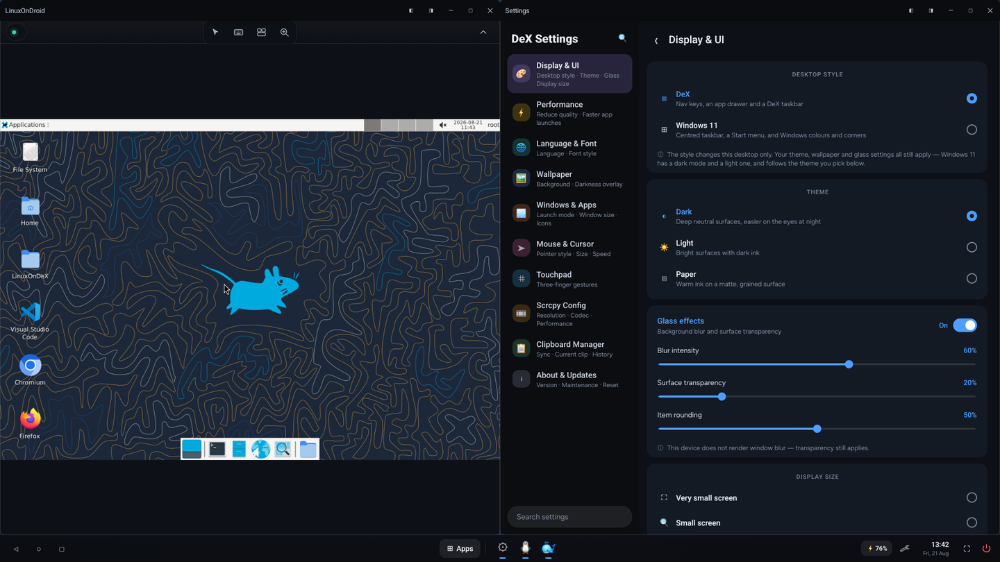
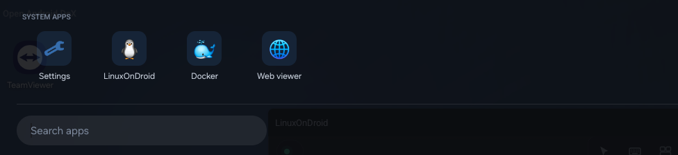
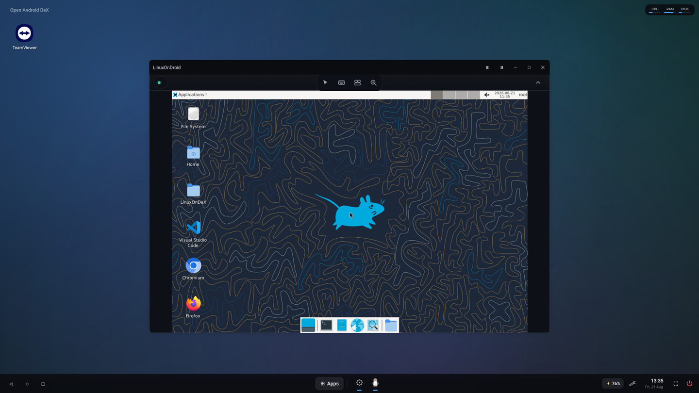
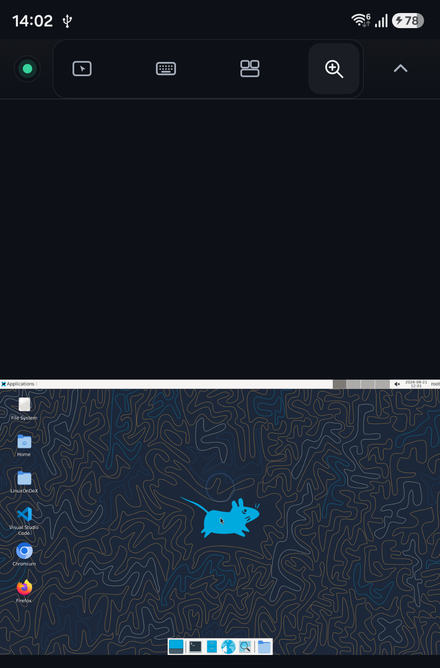
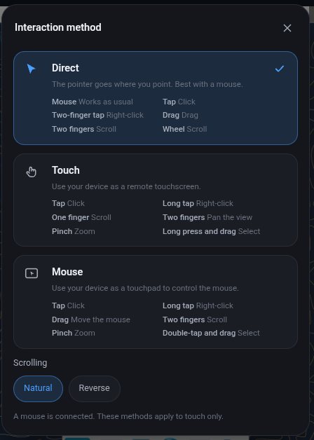
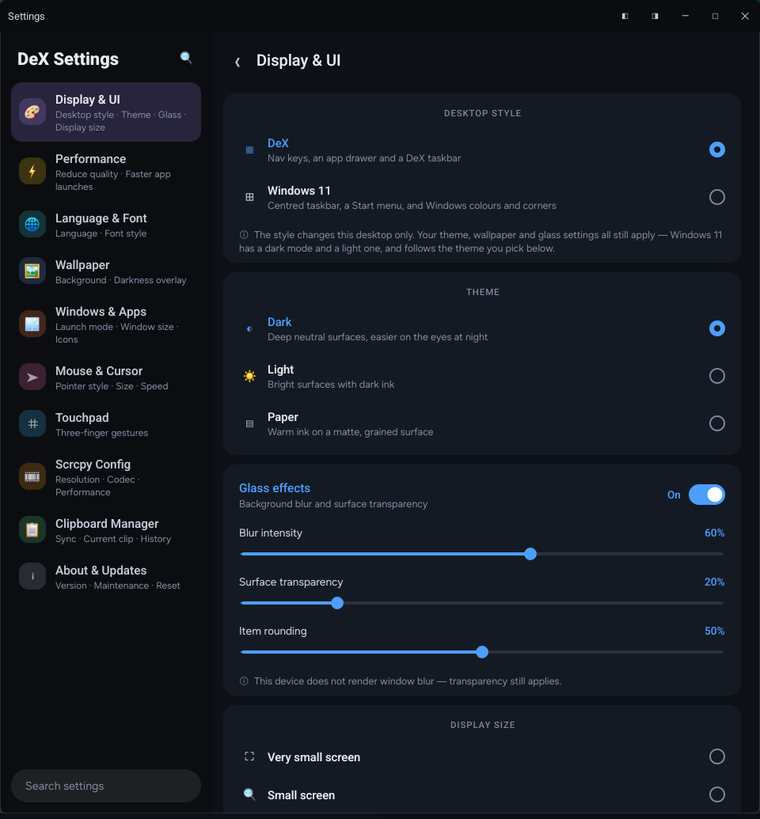
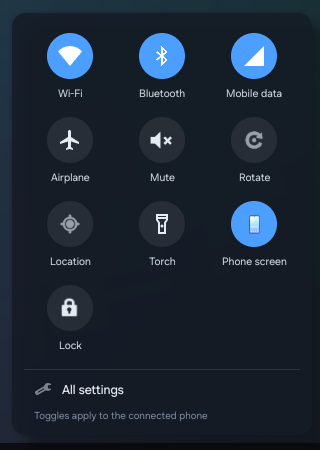

<div align="center">

# Open Android DeX

### Your phone is already a computer. This gives it a desktop.

Plug your Android phone into your Windows PC or Mac and a real desktop opens on
your screen, with a taskbar, an app drawer, and windows you can drag, resize and
snap side by side.

Unplug it and your phone goes back to being a phone.

[](https://github.com/dotnetdreamer/open-android-dex/releases/latest)
[](LICENSE)
[](https://github.com/dotnetdreamer/open-android-dex/releases/latest)

**Free. Open source. No account. No subscription. No root.**



<sub>Ubuntu snapped to the left, the desktop's own settings app snapped to the right, both running on the phone.</sub>

</div>

---

## Try it in three steps

1. **Download** the app for [Windows or Mac](https://github.com/dotnetdreamer/open-android-dex/releases/latest) and install it
2. **Turn on USB debugging** on your phone. Go to Settings, then About phone,
   tap *Build number* seven times, go back, open Developer options and switch on
   USB debugging
3. **Plug the phone in** and tap *Allow* when it asks

The desktop opens on its own and the app gets out of your way. There is nothing
to install on the phone. Everything it needs comes inside the download.

> **Any Android phone running Android 8 or newer will work.** You do not need a
> Samsung, a special cable, a monitor, or root.

---

## What you get

### A desktop that behaves like one

This is not a copy of your phone screen stretched out. It is a desktop, running
at your monitor's size, sitting next to your other windows.

- **A taskbar** along the bottom with your open apps, a clock and calendar, a
  battery indicator, and quick switches for Wi-Fi, Bluetooth, mobile data,
  airplane mode, torch and rotation, plus one that turns the phone's own screen
  off while the desktop keeps running
- **Proper windows.** Every app gets a title bar with close, minimise, maximise
  and snap left or right. Drag them where you want. Resize them from a corner.
  Put two apps side by side and get something done
- **An app drawer** you can search, and a desktop you can drop shortcuts onto
- **Your home screen widgets**, the real ones, live and working, on the desktop.
  Your calendar, your music, your weather. Click inside one and the app opens in
  a window instead of taking over the screen
- **Drag files from your computer** onto the phone. App files install
  themselves
- **Two looks.** A DeX style desktop, or a Windows 11 style one with a Start
  button. Switch between them in one click

Open the app drawer and the four built in tools sit at the top, above everything
else you have installed.



### Ubuntu, a whole Linux computer, running on your phone

This is Ubuntu 24.04 with a full desktop, running on the phone itself, in a
window on your screen. Not a terminal.

Firefox, Chromium, VS Code, git and SSH are already installed. There is a shared
folder so files move between Android and Linux without any fuss. No root, and no
long setup guide to follow. Press the button and let it download.



**You can also get just the Linux part on its own.** On the
[releases page](https://github.com/dotnetdreamer/open-android-dex/releases/latest)
there is a separate download called **LinuxOnDroid**. It is about 1 MB, you
install it on the phone by itself, and that is all you need. No computer, no
cable, no desktop app. Tap the icon and Ubuntu opens on your phone. Keep about
3 GB free for it.



A control strip sits along the top wherever Linux is running, on the phone or in
a window. It holds the pointer, the keyboard, the screen and zoom. Tap the
pointer and you pick how touch should behave: point where you look, use the
screen as a touchscreen, or use it as a trackpad. Each one spells out what taps,
drags and two finger gestures do.



### Your desktop in a web browser

Open the Web viewer, press Start, and the phone shows you a web address.

Type that address into a browser on your laptop, a work computer, or anyone
else's machine, enter the six digit code the phone shows you, and the whole
desktop appears in the browser tab. Click things. Type. Browse the phone's files
and download them. Drag files onto the page to send them over.

Nothing gets installed on the other machine. No extension, no app, no account,
no sign up. Just a browser.

On your home Wi-Fi it works with no setup at all. If you want to reach your
phone from anywhere in the world, including over mobile data, it can do that too
without you opening a single port on your router.

### Docker, running on a phone

A working Docker engine, on a normal phone, with no root.

`docker pull`, `docker run` and `docker compose` all work. You get your
containers and images listed in a window, plus a terminal. It is not fast,
because it is a phone, but it is the real thing.

### Make it look how you want

There is a proper Settings app inside the desktop. Ten sections, around forty
things you can change, and every change shows up straight away. No Apply button
and no restart.

- **Themes.** Dark, light, and a warm paper theme
- **Wallpapers.** Eleven of them, plus a dimmer slider
- **Languages.** Nine, including Hindi, Gujarati, Arabic, Chinese, Spanish,
  French, German and Portuguese, or just follow whatever your phone is set to
- **Mouse pointers.** Pick a shape, a colour, an outline and a size
- **Trackpad gestures.** Five three finger gestures, and you choose what each
  one does
- **Picture quality.** Resolution, frame rate, sharpness and sound, so you can
  trade smoothness for battery life on an older phone
- **Text size, window behaviour and clipboard sharing**, among others




### Cut the cable

Start over USB, switch to Wi-Fi, then pull the cable out. Your phone gets
remembered, so next time it connects on its own. If the connection drops it
comes back by itself.

You can also connect wirelessly from the start by scanning a QR code the app
puts on your screen.

### It leaves your phone alone

Everything it changes gets put back when you are done, automatically. That
happens even if you yank the cable out mid session, because the phone tidies up
after itself a short while later. Nothing keeps running and nothing stays
switched on behind your back.

---

## How it compares

|  | **Open Android DeX** | Samsung DeX | Android 16 desktop mode | scrcpy | Vysor / AirDroid |
| --- | :---: | :---: | :---: | :---: | :---: |
| Works on any Android phone | ✅ Android 8+ | ❌ Samsung only | ❌ recent Pixels and tablets | ✅ | ✅ |
| Needs a monitor or special cable | ❌ uses your PC screen | ✅ required | ✅ required on phones | ❌ | ❌ |
| Needs root | ❌ never | ❌ | ❌ | ❌ | ❌ |
| Resizable windows with title bars | ✅ | ✅ | ✅ | ❌ one mirror window | ❌ one mirror window |
| Live home screen widgets on the desktop | ✅ | ❌ | ❌ | ❌ | ❌ |
| Full Ubuntu desktop included | ✅ | ❌ dropped in 2019 | ⚠️ separate terminal app | ❌ | ❌ |
| Docker | ✅ | ❌ | ❌ | ❌ | ❌ |
| Free and open source | ✅ GPL 3.0 | ❌ | part of the OS | ✅ Apache 2.0 | ❌ |
| Account or subscription | ❌ none | ❌ none | ❌ none | ❌ none | ✅ required |

<sub>Put together from each project's public documentation in August 2026. If
something here is wrong,
[tell us](https://github.com/dotnetdreamer/open-android-dex/issues) and we will
fix it.</sub>

Samsung DeX only works on Samsung phones and needs a monitor. Google's desktop
mode needs a recent phone and a monitor as well. scrcpy is excellent software,
but it mirrors your phone rather than giving it a desktop. The commercial
mirroring apps put your phone in a window and then charge you every month for
the useful half of it. Open Android DeX runs on almost any phone, using the
screen already in front of you, for nothing.

---

## What you need

| | |
| --- | --- |
| **Your computer** | Windows 10 or 11, or a Mac (Intel or Apple Silicon) |
| **Your phone** | Any Android 8.0 or newer |
| **A cable** | Any USB cable that carries data, or skip it and use Wi-Fi |
| **Root** | No |
| **An account** | No |
| **Money** | No |

**Which download?**

| Your machine | File |
| --- | --- |
| Windows | `..._x64-setup.exe` (installer) or `..._x64_portable.zip` |
| Mac, Apple Silicon (M1 to M4) | `..._aarch64.dmg` |
| Mac, Intel | `..._x64.dmg` |
| **Just Ubuntu, phone only** | `LinuxOnDroid-v<version>.apk` |

---

## Questions people ask

<details>
<summary><b>Do I need to root my phone?</b></summary>

No. Nothing here needs root and nothing needs Shizuku. All it uses is USB
debugging, which is a normal Android setting.
</details>

<details>
<summary><b>Does this change my phone permanently?</b></summary>

No. It switches a few display settings on while the desktop is running and puts
them all back afterwards, including when you unplug without closing the app.
</details>

<details>
<summary><b>Will it work on my phone?</b></summary>

Almost certainly, if it runs Android 8 or newer. It does not need Samsung
hardware, DisplayPort, a dock or an adapter. A few phones with unusual software
handle windows differently, so if yours misbehaves please
[open an issue](https://github.com/dotnetdreamer/open-android-dex/issues).
</details>

<details>
<summary><b>My Mac says the app is damaged or will not open it.</b></summary>

That is macOS being careful about apps that have not paid Apple's notarisation
fee. Open Terminal and paste this once:

```bash
xattr -dr com.apple.quarantine "/Applications/Open Android DeX.app"
```

Then open it normally. macOS may also ask for Local Network permission, which is
for Wi-Fi connections, and Accessibility, which is only used by the fullscreen
button. USB needs neither.
</details>

<details>
<summary><b>Can I use the Ubuntu part without a computer?</b></summary>

Yes. That is what the separate **LinuxOnDroid** download on the
[releases page](https://github.com/dotnetdreamer/open-android-dex/releases/latest)
is for. About 1 MB, installed on the phone, and you tap the icon to get Ubuntu
fullscreen. No cable and no desktop app.

If you install both, they keep their own separate copies of Ubuntu, because
Android does not let one app read another's files. That means two downloads.
</details>

<details>
<summary><b>The Ubuntu install stops halfway on my Xiaomi, Samsung or Huawei.</b></summary>

Those phones are aggressive about killing apps that run for a long time with the
screen off, and the first Ubuntu setup takes a while. Turn off battery
optimisation for the app before you start the install. If you are using it
through the desktop app this is handled for you.
</details>

<details>
<summary><b>Is my screen going through someone else's server?</b></summary>

No. Over USB or your own Wi-Fi nothing leaves your network. If you set up remote
access from anywhere, you point it at a server you run yourself, and even then
only a small amount of connection setup passes through it. Your screen and your
access code never do.
</details>

<details>
<summary><b>Something went wrong. What do I send you?</b></summary>

Press the **Diagnostics** button in the app. It writes one file with everything
needed to work out what happened, so attach that to an issue.

The plain log lives here if you want to read it yourself:

```
Windows   %LOCALAPPDATA%\com.ccrstech.openandroiddex\logs\open-android-dex.log
macOS     ~/Library/Logs/com.ccrstech.openandroiddex/open-android-dex.log
```
</details>

---

## For developers

<details>
<summary><b>Building it yourself, and how the project is laid out</b></summary>

**You will need:** Node 20 or newer, Rust (stable), JDK 17 or newer, and the
Android SDK (platforms `android-35` and `android-36`, build tools with `d8`),
with `ANDROID_HOME` and `JAVA_HOME` set. Windows also needs VS Build Tools with
the C++ workload. macOS needs the Xcode command line tools.

```bash
cd open-android-dex-tauri
npm install
npm run tauri dev
```

`npm run tauri dev` is **the** way to run this. It rebuilds both phone side
payloads, deploys them, and applies permissions in the order that matters.
Hand launching scrcpy or sideloading the APK skips all of that.

```bash
npm run tauri build     # Windows -> bundle/nsis/ ; macOS -> bundle/{macos,dmg}/
npm run apk             # phone side payloads only
cargo test              # from src-tauri/

# The standalone LinuxOnDroid APK, from openandroiddex-launcher/
./gradlew :linuxapp:assembleDebug

# Frontend only work, no JDK or Android SDK needed:
SKIP_LAUNCHER_APK=1 SKIP_WMD_DEX=1 npm run tauri dev

# Raise the log level (default: debug)
OADX_LOG=trace npm run tauri dev
```

A fresh clone has an empty `src-tauri/resources/bin/`. Unpack the matching
scrcpy release into it, flattened, for a local bundle. Rebuilding the native
prebuilts is rarely needed and requires Docker:

```bash
bash openandroiddex-linux/proot/build.sh    # libproot.so, libloader*.so
bash openandroiddex-docker/qemu/build.sh    # libqemu.so
```

**Releasing.** One dispatch versions everything, builds it and cuts the release:

```bash
gh workflow run desktop.yml -f bump=patch      # or -f version=0.4.0, or -f dry_run=true
```

**Where things live**

| Path | What it is |
| --- | --- |
| [open-android-dex-tauri/](open-android-dex-tauri/) | The PC app. Tauri v2 (Rust) plus React 19, TypeScript, Vite and Tailwind v4 |
| [openandroiddex-launcher/](openandroiddex-launcher/) | The desktop shell that runs on the phone. Everything you see |
| [openandroiddex-wmd/](openandroiddex-wmd/) | The small window daemon that moves and resizes app windows |
| [openandroiddex-linux/](openandroiddex-linux/) | Ubuntu provisioning and runtime scripts |
| [openandroiddex-docker/](openandroiddex-docker/) | The Alpine VM scripts and QEMU build |
| [openandroiddex-signal/](openandroiddex-signal/) | Optional relay for reaching a phone from anywhere. One Node file with no dependencies |
| [test/](test/) | End to end checks that run without a phone |
| [doc/](doc/) | Design records explaining why things are built the way they are. **Read these before changing window management** |
| [.agents/AGENTS.md](.agents/AGENTS.md) | Rules for AI coding agents and contributors |

Contributions are welcome. Please read the relevant record in [doc/](doc/)
first, because several decisions there look arbitrary until you see what was
measured.
</details>

---

## Licence

Copyright © 2026

Open Android DeX is free software under the **GNU General Public License v3.0
or later**. See [LICENSE](LICENSE). It ships alongside independent third party
software that keeps its own licences, including scrcpy, adb, QEMU, proot and
FFmpeg. See [COPYRIGHT](COPYRIGHT) and
[THIRD_PARTY_LICENSES.md](open-android-dex-tauri/src-tauri/resources/THIRD_PARTY_LICENSES.md).

<div align="center">

**If this is useful to you, a ⭐ helps other people find it.**

[Download](https://github.com/dotnetdreamer/open-android-dex/releases/latest) ·
[Report a problem](https://github.com/dotnetdreamer/open-android-dex/issues) ·
[Discussions](https://github.com/dotnetdreamer/open-android-dex/discussions)

</div>
